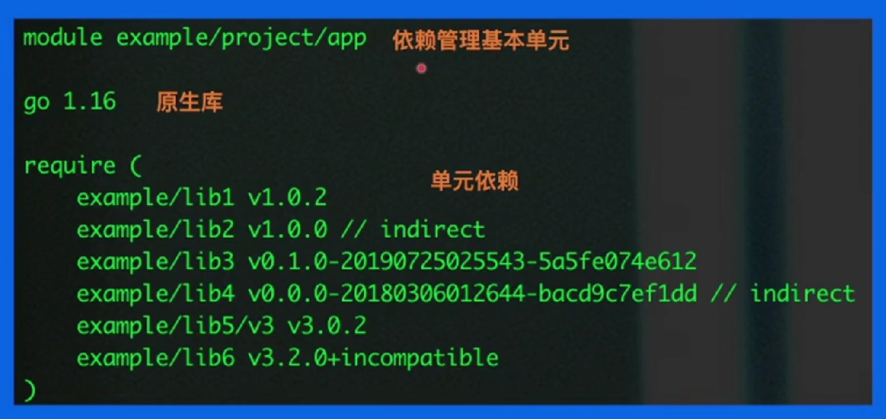

# Go的依赖管理
## 依赖管理演进
GOPATH --> GO Vender --> Go Module

+ 不同环境（项目）依赖的版本不同
+ 控制依赖库的版本

## 1. GOPATH
在项目开发中，任何项目免不了对第三方项目包依赖引用，可以方便**直接调用想并获得结果**，可以避免的代码逻辑的复杂性和冗余性。

> golang语言默认使用 GOPATH 来管理go的工程。

手动配置到环境变量中的，可以理解成go的 **workspace**

**GOPATH文件结构**
有三个子目录：

|——— bin 项目编译的二进制文件

|——— pkg 项目编译的中间产物，加速编译
    
|——— src 项目源码

+ 项目代码直接依赖src下的代码
+ 可以使用go get下载最新版本的包到src目录下

当我们在src目录中写的模块是main时, 它会对应到一个可执行文件, 并且编译后的文件会被复制到bin目录； 如果是其他模块, 它会被编译成一个库文件, 并且被复制到pkg目录；

> 这就是我们必须提供三个目录的原因, 一个放源代码, 一个放编译后的可执行文件, 另外一个放编译后的库文件。

## 2. Go Vendor
当我们在使用GOPATH的时候，可能遇到这样一个问题，就是在GOPATH模式下的每一个包都是独立存在的，什么意思呢，这样代表同一个依赖的不同版本是不能同时存在于项目当中的。于是就会出现冲突问题，所以我们引入了Go Vendor

Go Vendor提供了一个方式，就是在每一个项目目录当中添加一个vendor文件夹，我们将该项目的所有依赖都放置在vendor文件夹当中，这样不同项目之间的依赖包就不会互相影响

+ 项目中新增vendor文件夹，所有依赖包副本形式放在 $ProjectRoot/vendor
+ 依赖的寻址方式为： vendor --> GOPATH

尽管如此，该方法还是出现了许多问题：
1. 当项目所依赖的包很多，这样分别下载依赖的方式导致包占的内春就会非常大，加大开销
2. 无法控制依赖的版本
3. 更新项目又可能出现依赖冲突，导致编译出错

## 3. Go Modules 
Go Module是go语言官方正式官宣的项目依赖管理方案，利用Go的Module的特性，再也不需要关心传统的GOPATH了，可以在任意一个地方新建一个Golang项目 

+ 通过 go.mod 文件管理依赖包版本
+ 通过 go get/go mod 指令工具管理依赖包

Go Module真正的完成了我们的终极目标，定义版本规则和管理项目依赖关系

从下图可以分析到，mod文件主要有以下三大部分组成 ：
1. 依赖管理单元
2. 原生库
3. 单元依赖

### go module的核心概念
Go Module以 **semantic version(语义版本化)** 和**Minimal Version Selection——MVS(最小版本选择)**为核心，相比dep更具稳定性；同时也解决了vendor代码库依赖过于庞大，造成存储浪费的问题

**semantic version 语义版本化**
+ 主版本号（MAJOR version）：当我们做了不兼容版本的API修改
+ 次版本号（MINOR version）：当我们做了向下兼容的功能性修改
+ 修订号（PATCH version）：当我们做了向下兼容的问题修改

这里，只要模块的主版本号(MAJOR)不变，次版本号(MINOR)以及修订号(PATCH)的变更都不会引起破坏性的变更(breaking change)

**MVS 最小版本选择**
在MVS最小版本选择之前，Go的选择算法非常的简单，并且提供了2中不同版本的选择算法
1. 第一种是go get的默认算法，当我们的本地有一个版本的时候，直接使用该版本，反之下载最新的版本；这样带来的缺点显而易见，就是当我们需要这个依赖包的最新版本时，但是可能会因为这个包已经存在且为最低版本，导致无法get到最新的
2. 第二种是go get -u的行为，下载并使用所有模块的最新版本，同上面的缺点一致，但我们使用该算法的时候，可能导致更新到太新的版本而导致无法正常工作

现在我们给定一个场景方便更好的理解MVS算法

module A --> pckD v1.0.4
module B --> pckD v1.2.1
module C --> pckD v1.4.3

我们给定三个module，他们都同时依赖pckD这个依赖包，且这个依赖包的最新版本为v1.5.0

这个时候，当我们先引入module A，Go就会选择使用v1.0.4这个版本

然后我们再引入module B，Go经过计算就会选择v1.2.1

最后我们在引入module C，Go又会将版本更新到v1.4.3，因为这是最新版本

这个时候我们突然删掉module C，那我们还会不会降级到v1.2.1呢？其实这个情况下直接降级所带来的开销是非常巨大的，所以我们的Go会判断v1.4.3版本下是否能正常运行，当项目可以正常运行后，我们就会一直使用v1.4.3这个一版本，同时这个版本也成为pckD的“最新但非最大”版本